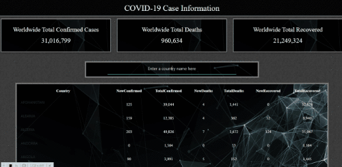

# Cov19-Restriction
A simple tool to provide restriction recommendations.

# Team Codename
KeepUsSafe...only from covid

# Team Members
Brennan Doehring
Troy Lochner
Shalom Dawit

# Objective
Creating a responsive and elegant webpage that gives the end-user current information (up to 8 weeks) on the Covid-19 Pandemic. The webpage uses a Covid-19 info api from https://covid19api.com/ and an article-search api from  https://developer.nytimes.com/docs/articlesearch-product/1/overview. Materialize was the css framework we chose because of it's simplicity along with great functionality and design. 

# User Story

This project is for users that are looking for covid information based on a past, present or future destination. Local government admisitrators along with residents in any district will be able to use these numbers to determine advisory changes. Another advantage is figuring out the direction of future economy analysis in relation to Covid-19 numbers. The table filter on the website works the same way as a search function would, making this information easy to get to.

